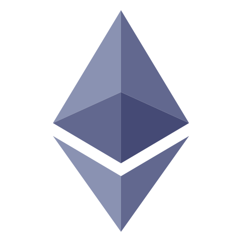

 

- #### I'm currently learning Full Stack Block Chain Application Development
- #### I know Intermediate level of Penetration Testing
- I'm currently learning more about
  - Web3
  - Block Chain Technology
  - DeFi
  - Japanese Language 日本語
  - Economics

 

# 🌐Socials

  

 

# 💻 Tech Stack

### BLOCK CHAIN

 &nbsp;  &nbsp; 

### WEB

      

  

   

### MOBILE

 

### DESIGN

  

 

# Notes by Me

- [Block Chain Developer Notes](https://github.com/sakibcy/blockchain-dev-notes)
- [Fultter Notes](https://github.com/sakibcy/Flutter-Features)
- [Responsive Web Design](https://github.com/sakibcy/responsive-web-design)

